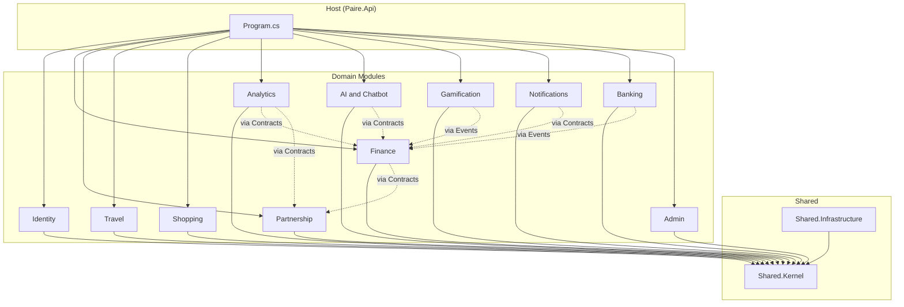

# Full Modular Monolith Refactoring

## Current State

- **Backend**: Single .NET 8 project with 28 controllers, 103 service files, 28+ models, single `AppDbContext` -- no enforced boundaries.
- **Frontend**: React 18 + Vite SPA with 32 pages, ~80 components, 6 service files -- flat structure except `travel/`.
- **Mobile**: React Native (Expo) app mirroring the frontend, similarly flat.

---

## Target Module Map




---

## Backend Target Structure

```
backend/
  Paire.sln
  src/
    Host/
      Paire.Api/                              # Slim host: Program.cs, middleware, appsettings
        Paire.Api.csproj
    Shared/
      Paire.Shared.Kernel/                    # Base entities, Result<T>, IModule, integration events
        Paire.Shared.Kernel.csproj
      Paire.Shared.Infrastructure/            # Email, storage, logging, currency, CSRF filter
        Paire.Shared.Infrastructure.csproj
    Modules/
      Paire.Modules.Identity/
        Contracts/                            # PUBLIC: IIdentityModule, ISessionService, UserDto
        Core/                                 # INTERNAL: entities, services, business rules
        Infrastructure/                       # INTERNAL: IdentityDbContext, EF config
        Api/                                  # INTERNAL: controllers
        IdentityModule.cs                     # IServiceCollection extension
        Paire.Modules.Identity.csproj
      Paire.Modules.Finance/                  # Same internal structure
      Paire.Modules.Partnership/
      Paire.Modules.Travel/
      Paire.Modules.Shopping/
      Paire.Modules.Analytics/
      Paire.Modules.AI/
      Paire.Modules.Gamification/
      Paire.Modules.Notifications/
      Paire.Modules.Banking/
      Paire.Modules.Admin/
  tests/
    Paire.Modules.Identity.Tests/
    Paire.Modules.Finance.Tests/
    ...
```

### Module Internal Structure (each module follows this)

```
Paire.Modules.{Name}/
  Contracts/              # PUBLIC types only
    I{Name}Module.cs      # Module's public interface
    DTOs/                 # Public DTOs other modules can use
    Events/               # Integration events this module publishes
  Core/                   # INTERNAL
    Entities/             # Domain models
    Services/             # Business logic
    Interfaces/           # Internal service interfaces
  Infrastructure/         # INTERNAL
    {Name}DbContext.cs    # Module-scoped DbContext
    Repositories/         # Data access
    ExternalServices/     # HTTP clients to external APIs
  Api/                    # INTERNAL
    Controllers/          # ASP.NET controllers
    Hubs/                 # SignalR hubs (if any)
  {Name}Module.cs         # AddXxxModule() extension method
```

### Key Design Principles

1. **Encapsulation**: `Core/` and `Infrastructure/` types are `internal`. Only `Contracts/` types are `public`.
2. **Cross-module deps**: Modules only reference other modules' `.Contracts` -- never `Core` or `Infrastructure`.
3. **Integration events**: MediatR `INotification` for decoupled cross-module communication (e.g., `TransactionCreatedEvent` triggers achievement checks).
4. **Per-module DbContext**: Each module has its own DbContext mapping only its entities, but all share the same physical PostgreSQL database.
5. **Module registration**: Each module exposes `AddXxxModule(this IServiceCollection)` called from `Program.cs`.

---

## Module Ownership Table


| Module            | Entities                                                                                                                                                                                       | Controllers                                                                                                                                             | Key Services                                                                                                                                                                                                 | Background Services                  |
| ----------------- | ---------------------------------------------------------------------------------------------------------------------------------------------------------------------------------------------- | ------------------------------------------------------------------------------------------------------------------------------------------------------- | ------------------------------------------------------------------------------------------------------------------------------------------------------------------------------------------------------------ | ------------------------------------ |
| **Identity**      | ApplicationUser, UserProfile, UserSession, UserStreak, AuthModels                                                                                                                              | AuthController, ProfileController, UsersController, StreaksController                                                                                   | ShieldAuthService, JwtTokenService, SessionService, TwoFactorAuthService, UserSyncService, ProfileService, UsersService, StreakService                                                                       | --                                   |
| **Finance**       | Transaction, Budget, Loan, LoanPayment, SavingsGoal, RecurringBill, RecurringBillAttachment, ImportHistory                                                                                     | TransactionsController, BudgetsController, LoansController, LoanPaymentsController, SavingsGoalsController, RecurringBillsController, ImportsController | TransactionsService, BudgetService, BudgetsAppService, LoansService, LoanPaymentsService, SavingsGoalsService, RecurringBillsService, ImportsService, BankStatementImportService, EntityFrameworkDataService | --                                   |
| **Partnership**   | Partnership, PartnershipInvitation                                                                                                                                                             | PartnershipController                                                                                                                                   | PartnershipService                                                                                                                                                                                           | --                                   |
| **Travel**        | Trip, TripCity, ItineraryEvent, PackingItem, TravelDocument, TravelExpense, TravelNote, TripLayoutPreferences, SavedPlace, TravelNotification, TravelNotificationPreferences, PushSubscription | TravelController, TravelNotificationsController, TravelChatbotController                                                                                | TravelService, TravelRepository, TravelNotificationService, TravelChatbotService, TravelGeocodingService, TravelAdvisoryService, TravelAttachmentService                                                     | TravelNotificationBackgroundService  |
| **Shopping**      | ShoppingList, ShoppingListItem                                                                                                                                                                 | ShoppingListsController                                                                                                                                 | ShoppingListsService                                                                                                                                                                                         | --                                   |
| **Analytics**     | Achievement, UserAchievement, FinancialHealthScore, WeeklyRecap, YearReview                                                                                                                    | AnalyticsController, AchievementsController, FinancialHealthController, WeeklyRecapController                                                           | AnalyticsService, AchievementService, FinancialHealthService, WeeklyRecapService, YearInReviewService                                                                                                        | WeeklyRecapBackgroundService         |
| **AI**            | Conversation                                                                                                                                                                                   | ChatbotController, AiGatewayController, ConversationsController                                                                                         | ChatbotService, AiGatewayClient, RagClient, RagContextService, ExpensesUserRagContextBuilder, ChatbotPersonalityService, ConversationService, ReportGenerationService                                        | --                                   |
| **Gamification**  | PaireHome, HomeFurniture, Challenge                                                                                                                                                            | PaireHomeController, ChallengesController                                                                                                               | PaireHomeService, ChallengeService                                                                                                                                                                           | --                                   |
| **Notifications** | ReminderPreferences                                                                                                                                                                            | RemindersController                                                                                                                                     | ReminderService, EmailService                                                                                                                                                                                | ReminderBackgroundService            |
| **Banking**       | BankConnection, StoredBankAccount                                                                                                                                                              | -- (accessed via Finance imports)                                                                                                                       | BankTransactionImportService, EnableBankingService                                                                                                                                                           | BankTransactionSyncBackgroundService |
| **Admin**         | SystemLog, AuditLog, DataClearingRequest                                                                                                                                                       | AdminController, SystemController, DataClearingController, PublicStatsController, SerpApiController, EconomicDataController, CurrencyController         | AdminService, AuditService, SystemService, DataClearingService, PublicStatsService, MetricsService, JobMonitorService, GreeceEconomicDataService, CurrencyService                                            | MonitoringBackgroundService          |


### Cross-Module Communication Map


| Event / Contract                     | Published By | Consumed By                                                             |
| ------------------------------------ | ------------ | ----------------------------------------------------------------------- |
| `IPartnershipResolver` (contract)    | Partnership  | Finance, Travel, Analytics                                              |
| `TransactionCreatedEvent`            | Finance      | Gamification (PaireHome, Challenges), Analytics (Achievements, Streaks) |
| `BudgetExceededEvent`                | Finance      | Notifications                                                           |
| `LoanSettledEvent`                   | Finance      | Analytics (Achievements)                                                |
| `SavingsGoalReachedEvent`            | Finance      | Gamification, Notifications                                             |
| `IFinanceSummaryProvider` (contract) | Finance      | Analytics, AI (RAG context)                                             |
| `IUserProfileProvider` (contract)    | Identity     | AI, Analytics                                                           |


---

## Frontend Target Structure

```
frontend/src/
  app/                          # App shell
    App.jsx
    main.jsx
    routes.jsx                  # Central route definitions
    providers/                  # ThemeContext, AuthProvider, WarmupContext, etc.
  shared/                       # Cross-feature shared code
    components/                 # Layout, Modal, Toast, FormField, Skeleton, ErrorBoundary...
    hooks/                      # useToast, useFocusTrap, useSwipeGesture, useCurrencyFormatter...
    services/                   # apiClient.js (base fetch wrapper), csrf.js, sessionManager.js
    context/                    # CalculatorContext, CurrencyPopoverContext, ModalContext...
    utils/                      # lazyWithRetry, getBackendUrl, formatCurrency, validation...
    styles/                     # index.css, global variables
  features/
    auth/
      pages/                    # Login, ForgotPassword, ResetPassword, EmailConfirmation, TwoFactorSetup
      components/               # TwoFactorVerification, SecurityBadge
      services/                 # auth.js (extracted from services/)
    finance/
      pages/                    # Dashboard, Expenses, Income, AllTransactions, Loans, Budgets...
      components/               # TransactionForm, BudgetProgressBar, SavingGoalProgressBar...
      hooks/                    # useRecentTransactions, useFormDraft
      services/                 # transactionService, loanService, budgetService, savingsGoalService...
      widgets/                  # ExpensesSummaryWidget, IncomeSummaryWidget, LoansSummaryWidget...
    partnership/
      pages/                    # Partnership, AcceptInvitation
      components/               # PartnershipSummaryWidget
      services/                 # partnershipService
    travel/                     # Already modularized -- relocate as-is
    shopping/
      pages/                    # ShoppingLists
      components/               # ShoppingListsSummaryWidget
      services/                 # shoppingListService
    analytics/
      pages/                    # Analytics, Achievements, EconomicNews, PaireScore, YearInReview, WeeklyRecap
      components/               # AnalyticsSummaryWidget, AchievementsSummaryWidget, WeeklyRecapWidget...
      services/                 # analyticsService, achievementService
    gamification/
      pages/                    # PaireHome, Challenges
      components/               # PaireHomeWidget, ChallengesWidget, StreakWidget
      services/                 # paireHomeService, challengeService
    ai/
      components/               # Chatbot
      services/                 # chatbotService, aiGatewayService
    notifications/
      pages/                    # ReminderSettings
      services/                 # reminderService
    banking/
      pages/                    # BankCallback
      components/               # PlaidConnect, BankStatementImport
      services/                 # openBanking
    profile/
      pages/                    # Profile
      services/                 # profileService
    admin/
      components/               # AdminLayout, AdminHeader
      services/                 # adminService
    legal/
      pages/                    # Landing, PrivacyPolicy, TermsOfService
  i18n/                         # Unchanged
  tests/                        # Reorganized to mirror features/
```

---

## Phase Breakdown

### PHASE 1: Foundation and Scaffolding

**Goal**: Set up the new solution structure without moving any code yet.

**Backend tasks:**

- Create `Paire.sln` in `backend/`
- Create `Paire.Shared.Kernel` project with:
  - `IModule` interface, `BaseEntity`, `Result<T>`, `IIntegrationEvent`
  - `BaseApiController` (moved from current project)
  - Common enums, constants
- Create `Paire.Shared.Infrastructure` project with:
  - `EmailService`, `SupabaseStorageService` (cross-cutting)
  - `SecureHeadersMiddleware`, `MetricsMiddleware`, `SessionValidationMiddleware`
  - `ValidateCsrfTokenFilter`
  - Daily file logger
- Create `Paire.Api` host project with a new `Program.cs` that:
  - References all module projects
  - Calls `AddXxxModule()` for each
  - Configures middleware pipeline
- Add MediatR NuGet package for integration events
- Keep the old `YouAndMeExpensesAPI` project intact and building

**Frontend tasks:** None yet.

**Validation**: Both old and new host projects compile. Old project still runs.

---

### PHASE 2: Identity Module

**Goal**: Extract authentication, user management, and session handling.

**Backend -- move into `Paire.Modules.Identity`:**

- **Api/**: `AuthController`, `ProfileController`, `UsersController`, `StreaksController`
- **Core/Entities/**: `ApplicationUser`, `UserProfile`, `UserSession`, `UserStreak`, `AuthModels`
- **Core/Services/**: `JwtTokenService`, `SessionService`, `TwoFactorAuthService`, `UserSyncService`, `ProfileService`, `UsersService`, `StreakService`, `ShieldAuthService`
- **Infrastructure/**: `IdentityDbContext` (maps Identity tables + UserProfile, UserSession, UserStreak)
- **Contracts/**: `IIdentityModule`, `ISessionService`, `IUserProfileProvider`, `UserDto`

**Decouple**: `TransactionsController` currently injects `IStreakService` -- replace with `TransactionCreatedEvent` that Identity's `StreakService` handles via MediatR.

**Frontend tasks:** None yet (auth services stay in place until Phase 8).

**Validation**: Login, registration, 2FA, profile CRUD, streaks all work end-to-end.

---

### PHASE 3: Partnership Module

**Goal**: Extract partnership management and establish the cross-module contract pattern.

**Backend -- move into `Paire.Modules.Partnership`:**

- **Api/**: `PartnershipController`
- **Api/Hubs/**: `PartnerHub`
- **Core/Entities/**: `Partnership`, `PartnershipInvitation`
- **Core/Services/**: `PartnershipService`
- **Infrastructure/**: `PartnershipDbContext`
- **Contracts/**: `IPartnershipResolver` (GetPartnerUserId, GetPartnershipStatus, GetHouseholdUserIds)

**Key pattern**: `IPartnershipResolver` becomes the contract that Finance, Travel, and Analytics reference instead of directly depending on `PartnershipService`.

**Validation**: Partnership invitations, accept/reject, partner data visible in finance views.

---

### PHASE 4: Finance Module (largest extraction)

**Goal**: Extract the core financial domain -- transactions, budgets, loans, savings, recurring bills, imports.

**Backend -- move into `Paire.Modules.Finance`:**

- **Api/**: `TransactionsController`, `BudgetsController`, `LoansController`, `LoanPaymentsController`, `SavingsGoalsController`, `RecurringBillsController`, `ImportsController`
- **Core/Entities/**: `Transaction`, `Budget`, `Loan`, `LoanPayment`, `SavingsGoal`, `RecurringBill`, `RecurringBillAttachment`, `ImportHistory`, `ImportedTransactionDTO`
- **Core/Services/**: `TransactionsService`, `BudgetService`, `BudgetsAppService`, `LoansService`, `LoanPaymentsService`, `SavingsGoalsService`, `RecurringBillsService`, `ImportsService`, `BankStatementImportService`, `EntityFrameworkDataService`
- **Infrastructure/**: `FinanceDbContext`
- **Contracts/**:
  - `IFinanceSummaryProvider` (used by Analytics, AI)
  - Events: `TransactionCreatedEvent`, `BudgetExceededEvent`, `LoanSettledEvent`, `SavingsGoalReachedEvent`
- **DTOs/**: `TransactionDTOs`, `AnalyticsDTOs` (finance-specific parts)

**Decouple**: Remove direct `IStreakService`, `IPaireHomeService`, `IChallengeService` injection from `TransactionsController` -- publish `TransactionCreatedEvent` instead.

**References**: `Partnership.Contracts` for partner-aware queries.

**Validation**: Full CRUD on all finance entities, receipt upload, CSV/PDF import, budget alerts.

---

### PHASE 5: Travel Module

**Goal**: Extract the already well-isolated travel domain.

**Backend -- move into `Paire.Modules.Travel`:**

- **Api/**: `TravelController`, `TravelNotificationsController`, `TravelChatbotController`
- **Core/Entities/**: All from `TravelModels.cs`, `TravelNotificationModels.cs`
- **Core/Services/**: `TravelService`, `TravelNotificationService`, `TravelChatbotService`, `TravelGeocodingService`, `TravelAdvisoryService`, `TravelAttachmentService`
- **Infrastructure/**: `TravelDbContext`, `TravelRepository` (from existing `Repositories/`)
- **Infrastructure/BackgroundServices/**: `TravelNotificationBackgroundService`
- **Contracts/**: `ITravelModule`
- **DTOs/**: `TravelDTOs`, `TravelNotificationDTOs`, `TuGoTravelAdvisoryModels`

**References**: `Partnership.Contracts` for shared trips.

**Validation**: Full trip CRUD, itinerary, packing, documents, expenses, geocoding, notifications, travel chatbot.

---

### PHASE 6: Remaining Backend Modules (batch extraction)

**Goal**: Extract all remaining smaller modules in one phase.

**6a. Shopping Module (`Paire.Modules.Shopping`):**

- `ShoppingListsController`, `ShoppingListsService`
- Entities: `ShoppingList`, `ShoppingListItem`

**6b. Analytics Module (`Paire.Modules.Analytics`):**

- `AnalyticsController`, `AchievementsController`, `FinancialHealthController`, `WeeklyRecapController`
- `AnalyticsService`, `AchievementService`, `FinancialHealthService`, `WeeklyRecapService`, `YearInReviewService`
- Entities: `Achievement`, `UserAchievement`, `FinancialHealthScore`, `WeeklyRecap`, `YearReview`
- Background: `WeeklyRecapBackgroundService`
- References: `Finance.Contracts`, `Partnership.Contracts`

**6c. AI Module (`Paire.Modules.AI`):**

- `ChatbotController`, `AiGatewayController`, `ConversationsController`
- `ChatbotService`, `AiGatewayClient`, `RagClient`, `RagContextService`, `ExpensesUserRagContextBuilder`, `ChatbotPersonalityService`, `ConversationService`, `ReportGenerationService`
- Entities: `Conversation`
- Configuration: `AiGatewayOptions`, `RagServiceOptions`
- DTOs: `AiGateway/`*, `ChatbotDTOs`
- References: `Finance.Contracts` (for RAG context), `Identity.Contracts`

**6d. Gamification Module (`Paire.Modules.Gamification`):**

- `PaireHomeController`, `ChallengesController`
- `PaireHomeService`, `ChallengeService`
- Entities: `PaireHome`, `HomeFurniture`, `Challenge`
- Subscribes to: `TransactionCreatedEvent` from Finance

**6e. Notifications Module (`Paire.Modules.Notifications`):**

- `RemindersController`
- `ReminderService`
- Entities: `ReminderPreferences`
- Background: `ReminderBackgroundService`
- References: `Finance.Contracts` (bill/loan/budget checks)

**6f. Banking Module (`Paire.Modules.Banking`):**

- `BankTransactionImportService`, `EnableBankingService`
- Entities: `BankConnection`, `StoredBankAccount` (from `OpenBankingModels`)
- Background: `BankTransactionSyncBackgroundService`
- Publishes: `BankTransactionsSyncedEvent` consumed by Finance

**6g. Admin Module (`Paire.Modules.Admin`):**

- `AdminController`, `SystemController`, `DataClearingController`, `PublicStatsController`, `SerpApiController`, `EconomicDataController`, `CurrencyController`
- `AdminService`, `AuditService`, `SystemService`, `DataClearingService`, `PublicStatsService`, `MetricsService`, `JobMonitorService`, `GreeceEconomicDataService`, `CurrencyService`
- Entities: `SystemLog`, `AuditLog`, `DataClearingRequest`
- Background: `MonitoringBackgroundService`
- Hub: `MonitoringHub`
- DTOs: `GreeceEconomicDataDTO`

**Validation**: Every feature still works. All integration events fire and are handled correctly.

---

### PHASE 7: Delete Old Project and Finalize Backend

**Goal**: Remove `YouAndMeExpensesAPI` project, ensure everything runs from `Paire.Api` host.

- Delete `backend/YouAndMeExpensesAPI/` directory
- Update `Paire.sln` to remove old project reference
- Move `Migrations/` into a `Paire.Migrations` project or into `Paire.Api` (EF migrations need a single context for schema evolution -- create a `MigrationDbContext` that composes all module entity configs)
- Move `appsettings.json`, `appsettings.Example.json` into `Paire.Api/`
- Update `Dockerfile` to build from `Paire.Api`
- Verify the app starts, all endpoints respond, all tests pass

---

### PHASE 8: Frontend Restructuring

**Goal**: Reorganize the React frontend into feature modules.

**Step 1 -- Create directory structure:**

```
src/app/         (new)
src/shared/      (new)
src/features/    (new)
```

**Step 2 -- Move shared code:**

- `components/Layout.jsx`, `Modal.jsx`, `Toast.jsx`, `FormField.jsx`, `Skeleton.jsx`, `ErrorBoundary.jsx`, `PageTransition.jsx`, `BottomNavigation.jsx`, etc. -> `shared/components/`
- `hooks/` -> `shared/hooks/`
- `context/` -> `app/providers/` (or `shared/context/`)
- `utils/` -> `shared/utils/`
- `styles/` -> `shared/styles/`
- Extract `apiClient` base from `services/api.js` -> `shared/services/apiClient.js`
- `services/csrf.js`, `services/sessionManager.js` -> `shared/services/`

**Step 3 -- Create feature modules (one at a time):**


| Feature                   | Pages to Move                                                                                                            | Components to Move                                                                                                                                                                                                                                                                   | Services to Extract                                                                                                          |
| ------------------------- | ------------------------------------------------------------------------------------------------------------------------ | ------------------------------------------------------------------------------------------------------------------------------------------------------------------------------------------------------------------------------------------------------------------------------------ | ---------------------------------------------------------------------------------------------------------------------------- |
| `features/auth/`          | Login, ForgotPassword, ResetPassword, EmailConfirmation, TwoFactorSetup                                                  | TwoFactorVerification, SecurityBadge                                                                                                                                                                                                                                                 | auth.js                                                                                                                      |
| `features/finance/`       | Dashboard, Expenses, Income, AllTransactions, Loans, Budgets, SavingsGoals, RecurringBills, Receipts, CurrencyCalculator | TransactionForm, BudgetProgressBar, SavingGoalProgressBar, TransactionDetailModal, TransactionTimeline, CategorySelector, BankStatementImport, DuplicateDetection, QuickFill, SplitTransaction, RecurringTransaction, CurrencyInput, DateInput, DatePicker, CalendarView, FileUpload | transactionService, loanService, budgetService, savingsGoalService, recurringBillService, importsService (split from api.js) |
| `features/partnership/`   | Partnership, AcceptInvitation                                                                                            | PartnershipSummaryWidget                                                                                                                                                                                                                                                             | partnershipService                                                                                                           |
| `features/travel/`        | (already modularized)                                                                                                    | (already modularized)                                                                                                                                                                                                                                                                | (already modularized)                                                                                                        |
| `features/shopping/`      | ShoppingLists                                                                                                            | ShoppingListsSummaryWidget                                                                                                                                                                                                                                                           | shoppingListService                                                                                                          |
| `features/analytics/`     | Analytics, Achievements, EconomicNews, PaireScore, YearInReview, WeeklyRecap                                             | AnalyticsSummaryWidget, AchievementsSummaryWidget, WeeklyComparisonWidget, WeeklyRecapWidget, EconomicNewsSummaryWidget                                                                                                                                                              | analyticsService, achievementService, weeklyRecapService, yearInReviewService                                                |
| `features/gamification/`  | PaireHome, Challenges                                                                                                    | PaireHomeWidget, ChallengesWidget, StreakWidget                                                                                                                                                                                                                                      | paireHomeService, challengeService                                                                                           |
| `features/ai/`            | --                                                                                                                       | Chatbot                                                                                                                                                                                                                                                                              | chatbotService, aiGatewayService                                                                                             |
| `features/notifications/` | ReminderSettings                                                                                                         | RemindersSummaryWidget                                                                                                                                                                                                                                                               | reminderService                                                                                                              |
| `features/banking/`       | BankCallback                                                                                                             | PlaidConnect                                                                                                                                                                                                                                                                         | openBanking                                                                                                                  |
| `features/profile/`       | Profile                                                                                                                  | AccessibilitySettings                                                                                                                                                                                                                                                                | profileService                                                                                                               |
| `features/admin/`         | --                                                                                                                       | AdminLayout, AdminHeader                                                                                                                                                                                                                                                             | adminService                                                                                                                 |
| `features/legal/`         | Landing, PrivacyPolicy, TermsOfService                                                                                   | --                                                                                                                                                                                                                                                                                   | --                                                                                                                           |


**Step 4 -- Update routing:**

- Create `app/routes.jsx` that imports page components from `features/*/pages/`
- Update `App.jsx` to use the new routes file
- Ensure all lazy loading still works

**Step 5 -- Split `services/api.js` (1439 lines):**

- Keep a slim `shared/services/apiClient.js` with just the `apiRequest()` base function
- Move each domain's API calls into `features/{domain}/services/{domain}Service.js`
- Each feature service imports `apiClient` from shared

**Validation**: All pages load, all API calls work, no broken imports.

---

### PHASE 9: Mobile App Restructuring

**Goal**: Mirror the frontend feature structure in the React Native mobile app.

- Reorganize `mobile-app/` to match the same `features/` pattern
- Move screens into `features/{domain}/screens/`
- Move domain-specific components into `features/{domain}/components/`
- Split mobile `services/api.js` the same way
- Update Expo Router navigation

---

### PHASE 10: CI/CD, Docker, and Documentation

**Goal**: Update all infrastructure to match the new structure.

- Update `Dockerfile` to point to `Paire.Api`
- Update all GitHub Actions workflows (paths, build commands)
- Update `vercel.json` if needed
- Update `docs/` with new architecture diagrams
- Update `.planning/codebase/STRUCTURE.md` and `ARCHITECTURE.md`
- Create a module dependency diagram in docs
- Write a MIGRATION_GUIDE.md for contributors

---

## Migration Safety Rules

1. **One phase at a time** -- each phase must compile, pass tests, and run before starting the next.
2. **Old project stays until Phase 7** -- the original `YouAndMeExpensesAPI` is only deleted after all code has been moved out.
3. **Feature parity check** -- after each phase, verify the migrated feature works end-to-end (API + frontend).
4. **No schema changes** -- all modules share the same PostgreSQL database and existing tables. Only the code is reorganized.
5. **Git branch per phase** -- each phase gets its own branch and PR for review.

