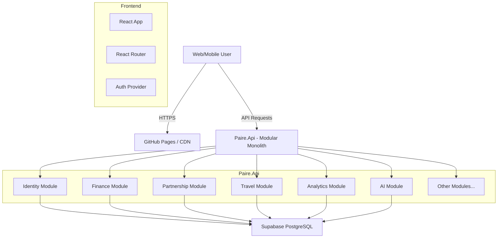

# Paire - Project Documentation
**Version:** 2.3.0
**Date:** March 14, 2026

---

## 1. Executive Summary

**Paire** is a comprehensive expense tracking and financial management platform designed specifically for couples. It enables users to track expenses, income, loans, and budgets, both individually and jointly. Distinguishing features include robust partnership sharing capabilities, an AI-powered financial chatbot, real-time economic data integration, and secure bank connectivity via Plaid.

The application leverages a modern technology stack with a React/Vite frontend, React Native (Expo) mobile app, and a .NET 8 **modular monolith** API backend, utilizing Supabase (PostgreSQL) for reliable data persistence and authentication.

---

## 2. Technical Architecture

### 2.1 Technology Stack

#### Frontend
*   **Framework:** React 18.2
*   **Build Tool:** Vite
*   **Routing:** React Router v6
*   **State Management:** React Context API
*   **Structure:** Feature-based (`features/`, `shared/`, `app/`)
*   **Styling:** CSS3 (Custom responsive design)
*   **Internationalization:** react-i18next (English, Greek, Spanish, French)
*   **HTTP Client:** Axios (Custom wrapper)

#### Mobile
*   **Framework:** React Native with Expo
*   **Routing:** Expo Router (file-based)
*   **Structure:** Feature-based (mirrors frontend)

#### Backend (Modular Monolith)
*   **Framework:** ASP.NET Core Web API (.NET 8.0)
*   **Architecture:** Modular monolith with domain modules
*   **Language:** C#
*   **ORM:** Entity Framework Core (per-module DbContexts)
*   **Messaging:** MediatR for integration events
*   **Authentication:** JWT with Supabase Auth / Shield integration
*   **API Documentation:** Swagger/OpenAPI

#### Database & Infrastructure
*   **Database:** PostgreSQL (via Supabase) — shared by all modules
*   **Auth Provider:** Supabase Auth / Shield
*   **Storage:** Supabase Storage (for receipts/avatars)
*   **Hosting:** Render.com (Backend), GitHub Pages (Frontend)

### 2.2 Backend Module Structure

The backend is organized as a **modular monolith**:

```
backend/
  Paire.sln
  src/
    Host/Paire.Api/              # Slim host
    Shared/
      Paire.Shared.Kernel/       # Base entities, Result<T>, integration events
      Paire.Shared.Infrastructure/ # Email, storage, logging, CSRF
    Modules/
      Paire.Modules.Identity/    # Auth, profiles, users, sessions, 2FA, streaks
      Paire.Modules.Finance/     # Transactions, budgets, loans, savings, imports
      Paire.Modules.Partnership/ # Partnerships, invitations, IPartnershipResolver
      Paire.Modules.Travel/      # Trips, itinerary, packing, documents, notifications
      Paire.Modules.Shopping/    # Shopping lists
      Paire.Modules.Analytics/  # Analytics, achievements, financial health, recaps
      Paire.Modules.AI/         # Chatbot, AI gateway, conversations
      Paire.Modules.Gamification/ # Paire Home, challenges
      Paire.Modules.Notifications/ # Reminders, email
      Paire.Modules.Banking/    # Bank sync, Plaid
      Paire.Modules.Admin/      # Admin, monitoring, audit
```

Each module exposes `AddXxxModule()` and uses **Contracts** for cross-module communication. Integration events (e.g., `TransactionCreatedEvent`) enable decoupled communication via MediatR.

### 2.3 System Architecture Diagram



---

## 3. Key Feature Modules

### 3.1 Financial Management
*   **Transactions:** Comprehensive logging of Income and Expenses with categorization, dates, and optional file attachments.
*   **Budgets:** Category-specific monthly limits with visual progress bars and alerts when nearing limits.
*   **Loans:** Dedicated tracking for money lent/borrowed, including installment plans and payment history.

### 3.2 Partnership & Collaboration
*   **Dual View:** Users can toggle between "Personal", "Partner", and "Combined" views for all financial data.
*   **Invitations:** Secure code-based invitation system to link partner accounts.
*   **Privacy:** Strict Row Level Security (RLS) ensures data is only accessible to the account owner and their linked partner.

### 3.3 Advanced Integrations
*   **Bank Sync (Plaid):** Securely link bank accounts to import transactions automatically.
    *   *Status:* Production-ready (Integration verified).
*   **AI Chatbot:** Natural language interface for financial queries (e.g., "How much did we spend on food last month?").
*   **Economic Data:** Real-time integration with Eurostat/Greek economic APIs for CPI, inflation, and GDP tracking.

### 3.4 Security
*   **MFA:** Multi-Factor Authentication support.
*   **Session Management:** Secure JWT handling with refresh tokens and device tracking.
*   **Encryption:** All data encrypted at rest (PostgreSQL) and in transit (TLS 1.2+).

---

## 4. Data Model (Database Schema)

The database is normalized and runs on PostgreSQL. Key entities include:

*   `AspNetUsers` / `user_profiles`: Stores user identity, preferences, and linkage to Supabase Auth.
*   `partnerships`: Maps relationships between two users.
*   `transactions`: Core ledger table for income/expense records. Linked to `user_id` and optional `category_id`.
*   `budgets`: Monthly storage of budget limits per category/user.
*   `loans`: Stores principal, interest rate, and terms for personal loans.
*   `loan_payments`: Ledger of repayments against specific loans.
*   `recurring_bills`: Configurations for automated recurring expense generation.
*   `bank_connections` / `bank_accounts`: Stores encrypted tokens and metadata for linked Plaid accounts.

---

## 5. API Reference Summary

The backend exposes over 75 RESTful endpoints across domain modules. Key controllers include:

*   **Identity:** `AuthController`, `ProfileController`, `UsersController`, `StreaksController`
*   **Finance:** `TransactionsController`, `BudgetsController`, `LoansController`, `LoanPaymentsController`, `SavingsGoalsController`, `RecurringBillsController`, `ImportsController`
*   **Partnership:** `PartnershipController`
*   **Travel:** `TravelController`, `TravelNotificationsController`, `TravelChatbotController`
*   **Shopping:** `ShoppingListsController`
*   **Analytics:** `AnalyticsController`, `AchievementsController`, `FinancialHealthController`, `WeeklyRecapController`
*   **AI:** `ChatbotController`, `AiGatewayController`, `ConversationsController`
*   **Gamification:** `PaireHomeController`, `ChallengesController`
*   **Notifications:** `RemindersController`
*   **Admin:** `AdminController`, `SystemController`, `DataClearingController`, `PublicStatsController`, etc.

*Full API documentation is available via the Swagger UI endpoint (`/swagger`) when running in Development mode.*

---

## 6. Deployment & Configuration

### 6.1 Requirements
*   **Runtime:** .NET 8 SDK, Node.js 18+
*   **Infrastructure:** PostgreSQL Database, Redis (Optional for caching)

### 6.2 Backend Run

```bash
cd backend
dotnet run --project src/Host/Paire.Api/Paire.Api.csproj
```

Or with Docker:

```bash
docker build -t paire-api -f backend/Dockerfile backend/
docker run -p 5038:80 paire-api
```

### 6.3 Environment Variables
**Backend (appsettings.json / appsettings.Example.json):**
*   `ConnectionStrings:DefaultConnection`
*   `Supabase:Url`, `Supabase:Key`
*   `JwtSettings:Secret`, `JwtSettings:Issuer`, `JwtSettings:Audience`
*   `Shield:BaseUrl` (for auth proxy)
*   `Plaid:ClientId`, `Plaid:Secret`
*   `EmailSettings:*` (Resend API or SMTP)

**Frontend (.env):**
*   `VITE_BACKEND_API_URL`
*   `VITE_SUPABASE_URL`

---

## 7. Compliance & Standards

*   **GDPR:** Includes "Right to be Forgotten" (Account Deletion) and Data Export features.
*   **PSD2:** Plaid integration supports Open Banking standards.
*   **Accessibility:** UI designed with high-contrast text and ARIA labels.
*   **Privacy Policy:** Dedicated privacy policy page (`/privacy`) detailing data collection, usage, and user rights.
*   **Cookie Consent:** Cookie consent banner implemented to comply with ePrivacy Directive and GDPR, allowing users to accept or decline non-essential cookies.

---
*Generated by Antigravity AI Assistant*
