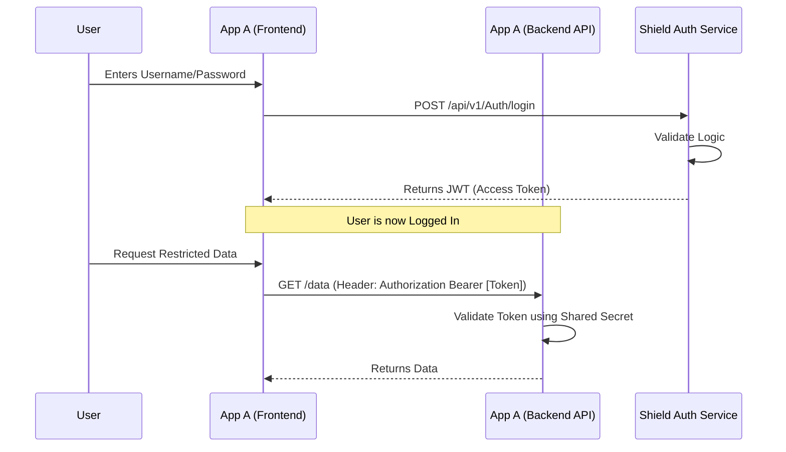

<!-- [MermaidChart: 2818f2ad-54ba-4c6b-a64a-ee4c10126b33] -->
# How to Connect Applications to Codename_Shield

This guide explains how to connect your external applications ("App A", "App B") to `Codename_Shield.API` for authentication.

## The Architecture: Shared Secret & JWT
The integration relies on **JWT (JSON Web Tokens)**.
1.  **The Shield (Issuer)**: Validates credentials and signs a token with a **Secret Key**.
2.  **Your Apps (Consumers)**: Validate the token using the **SAME Secret Key**.



---

## Step 1: Establish the Shared Configuration

You must ensure that **Codename_Shield** and **App A/B** share the exact same JWT settings in their `appsettings.json`.

**In Codename_Shield.API:**
```json
  "JwtSettings": {
    "Issuer": "Codename_Shield",
    "Audience": "SenseiHub_Ecosystem",
    "Secret": "THIS_DATA_MUST_BE_SHARED_AND_STRONG_KEY_AT_LEAST_32_CHARS" 
  }
```

**In App A & App B (Backend):**
Copy these settings exactly. The `Secret` **must match**.

---

## Step 2: Configure App A & B (Backend)

Your client applications need to know how to validate the token issued by Shield.

### If App A is a .NET Core API:
Install the package:
`Microsoft.AspNetCore.Authentication.JwtBearer`

In `Program.cs`:
```csharp
builder.Services.AddAuthentication(options =>
{
    options.DefaultAuthenticateScheme = JwtBearerDefaults.AuthenticationScheme;
    options.DefaultChallengeScheme = JwtBearerDefaults.AuthenticationScheme;
})
.AddJwtBearer(options =>
{
    // Important: These must match Codename_Shield settings exactly
    options.TokenValidationParameters = new TokenValidationParameters
    {
        ValidateIssuer = true,
        ValidIssuer = "Codename_Shield", // Matches Shield's Issuer
        
        ValidateAudience = true,
        ValidAudience = "SenseiHub_Ecosystem", // Matches Shield's Audience

        ValidateIssuerSigningKey = true,
        IssuerSigningKey = new SymmetricSecurityKey(Encoding.UTF8.GetBytes("THIS_DATA_MUST_BE_SHARED_AND_STRONG_KEY_AT_LEAST_32_CHARS")),
        
        ValidateLifetime = true // Check if token is expired
    };
});
```

Now, simply use `[Authorize]` on your controllers. The app will trust tokens signed by Shield.

---

## Step 3: Implement the Login Flow (Frontend)

Your frontend (React, Angular, Mobile) needs to talk to Shield to get the token.

**1. Login Request**
Send a request directly to the authentication service.
*   **URL**: `https://[Shield-Url]/api/v1/Auth/login`
*   **Body**: `{ "username": "...", "password": "..." }`

**2. Handle Response**
Shield returns:
```json
{
  "accessToken": "eyJhbGciOiJIUz...",
  "refreshToken": "..."
}
```

**3. Store Token**
Save the `accessToken` (e.g., in `localStorage` or memory).

**4. Call App A/B**
When making requests to your *own* backend (App A), attach the token:
*   **Header**: `Authorization: Bearer eyJhbGciOiJIUz...`

---

## Multi-Tenant Support

Shield now supports multi-tenancy through the `TenantId` field. This allows you to associate users with specific tenants/applications.

### Tenant Assignment During Registration

When registering a new user, provide the tenant ID via the `X-Tenant-Id` header:

```http
POST /api/v1/auth/register
Content-Type: application/json
X-Tenant-Id: your-tenant-id

{
  "username": "user@example.com",
  "email": "user@example.com",
  "password": "SecurePassword123!",
  "fullName": "User Name"
}
```

### Tenant Information in JWT

When a user with a tenant logs in, the JWT will include a `tenant_id` claim:

```json
{
  "http://schemas.xmlsoap.org/ws/2005/05/identity/claims/name": "user@example.com",
  "tenant_id": "your-tenant-id",
  "jti": "...",
  "exp": 1234567890
}
```

### Accessing Tenant in Your Application

In your .NET backend, access the tenant claim:

```csharp
[Authorize]
[HttpGet("my-endpoint")]
public IActionResult MyEndpoint()
{
    var tenantId = User.Claims.FirstOrDefault(c => c.Type == "tenant_id")?.Value;
    
    if (string.IsNullOrEmpty(tenantId))
    {
        return BadRequest("No tenant associated with this user");
    }
    
    // Use tenantId for data filtering, authorization, etc.
    return Ok($"Your tenant: {tenantId}");
}
```

### Querying Tenant Information

**Get Current User's Tenant:**
```http
GET /api/v1/auth/user-tenant
Authorization: Bearer <JWT_TOKEN>
```

**Get Users by Tenant (Admin only):**
```http
GET /api/v1/auth/tenant-users/{tenantId}
Authorization: Bearer <ADMIN_JWT_TOKEN>
```

---

## Summary
*   **Authentication** (Who are you?) happens at **Codename_Shield**.
*   **Authorization** (What can you do?) happens at **App A/B** by validating the token.
*   **Multi-Tenancy** is supported via `X-Tenant-Id` header during registration and `tenant_id` JWT claim.

