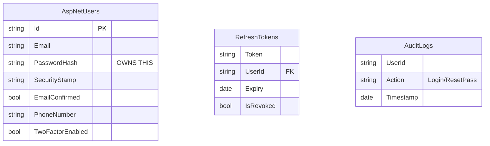
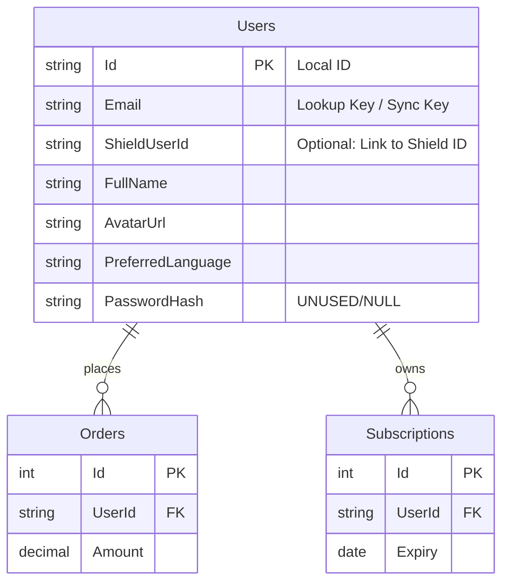

# Architecture: Data Separation (Shield vs Client App)

## Core Concept
**Shield** is your **Identity Provider (IdP)**. It answers: *"Who is this user?"*
**Client App** (e.g., SenseiHub) is your **Service Provider (SP)**. It answers: *"What is this user doing?"*

## 1. Shield Microservice (The Guard)
**Responsibility**: Security, Credentials, and Identity.
**Data it OWNS**:
- **Credentials**: Passwords (hashed), Salt, Recovery Codes.
- **Identity**: `Email` (verified?), `PhoneNumber` (verified?), `Username`.
- **Session**: `RefreshTokens`, `LoginHistory`, `ActiveSessions`.
- **Global Roles**: `SystemAdmin`, `Support`.

### Shield Database Schema (Simplified)

## 2. Client Application (The Service)
**Responsibility**: Business Logic, User Profiles, Domain Relationships.
**Refers to**: Any application consuming Shield (e.g., SenseiHub, Mobile App, Partner Portal).
**Data it OWNS**:
- **Profile**: `FullName`, `DateOfBirth`, `Preferences` (Dark Mode, Language).
- **Domain**: `Orders`, `Subscriptions`, `Memberships`, `Instructors`.
- **Local Roles**: `Manager`, `Editor`, `Viewer`.

### Client App Database Schema (The "Shadow User")
The Client App keeps a **Shadow User** table. It allows you to link domain data (like "Orders") to a User without needing to ask Shield for the user's ID every time.

> [!IMPORTANT]
> The Client App's `Users` table should **NOT** contain `PasswordHash`, `SecurityStamp`, or `TwoFactor` recovery codes.
> **Note**: For framework compatibility (like ASP.NET Identity), the `Users` entity might strictly inherit from `IdentityUser`, but security columns must remain **NULL** or be strictly ignored.

## How they Sync
Since Shield is the "Source of Truth" for Identity (Email/Password), and the Client App is the "Source of Truth" for Profiles:

1.  **Registration**:
    *   User fills form on Client App.
    *   Client App calls `Shield.Register(email, password)`.
    *   Shield creates Auth User.
    *   Client App creates Local "Shadow" User (with same Email).
2.  **Login**:
    *   Client App sends credentials to Shield.
    *   Shield validates and returns Token (with `Email` claim).
    *   Client App trusts Token, looks up Local User by `Email`.
3.  **Updates**:
    *   **Password Change**: Must go to Shield.
    *   **Profile Change (Name)**: Stays in Client App.

## Summary Recommendation
| Data Point | Shield DB | Client App DB |
| :--- | :---: | :---: |
| **Email** | ✅ (Primary Key) | ✅ (Sync Key) |
| **Password** | ✅ | ❌ |
| **Full Name** | ❌ (Optional) | ✅ |
| **Domain Data** | ❌ | ✅ |
| **Refresh Tokens** | ✅ | ❌ |
