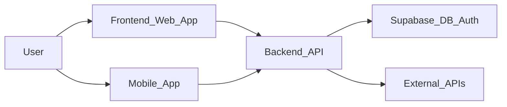

## 🧱 Architecture Overview

This page is the entry point for understanding how Paire is structured across the **frontend**, **backend (.NET API)**, **Supabase (DB & auth)**, **mobile app**, and **external integrations**. Use it to jump into deeper implementation reports, migration guides, and roadmap documents.

### System diagram

### Backend architecture

- **[BACKEND_IMPLEMENTATION_SUMMARY.md](../BACKEND_IMPLEMENTATION_SUMMARY.md)** – backend implementation overview
- **[backend-controller-to-service-pattern.md](../backend-controller-to-service-pattern.md)** – controller-to-service refactor pattern
- **[CONTROLLER_MIGRATION_GUIDE.md](../CONTROLLER_MIGRATION_GUIDE.md)** – controller migration strategies
- **[CONTROLLERS_MIGRATION_STATUS.md](../CONTROLLERS_MIGRATION_STATUS.md)** – controller migration status

### Frontend & mobile architecture

- **[FRONTEND_IMPLEMENTATION_GAPS.md](../FRONTEND_IMPLEMENTATION_GAPS.md)** – known frontend gaps and follow-ups
- **[FRONTEND_PERFORMANCE_OPTIMIZATIONS.md](../FRONTEND_PERFORMANCE_OPTIMIZATIONS.md)** – performance-focused architectural notes
- **[QUICK_START_FRONTEND_IMPLEMENTATION.md](../QUICK_START_FRONTEND_IMPLEMENTATION.md)** – high-level frontend structure and patterns

### Cross-cutting concerns

- **[FINAL_IMPLEMENTATION_REPORT.md](../FINAL_IMPLEMENTATION_REPORT.md)** – end-to-end implementation report
- **[IMPLEMENTATION_SUMMARY.md](../IMPLEMENTATION_SUMMARY.md)** – overall implementation summary
- **[IMPLEMENTATION_GAPS.md](../IMPLEMENTATION_GAPS.md)** – remaining implementation gaps
- **[RAG_SETUP.md](../RAG_SETUP.md)** – RAG / thinking-mode architecture and data flow
- **[SUPABASE_MIGRATION_SUMMARY.md](../SUPABASE_MIGRATION_SUMMARY.md)** – Supabase schema and RLS evolution

### Roadmap & phases

- **[COMPLETE_FEATURES_ROADMAP.md](../COMPLETE_FEATURES_ROADMAP.md)** – complete feature set and roadmap
- **[FEATURE_ROADMAP.md](../FEATURE_ROADMAP.md)** – roadmap highlights
- **[PHASE_4_IMPLEMENTATION.md](../PHASE_4_IMPLEMENTATION.md)** – phase 4 plan and notes
- **[PHASE_5_IMPLEMENTATION.md](../PHASE_5_IMPLEMENTATION.md)** – phase 5 plan and notes
- **[PHASE_6_PROPOSAL.md](../PHASE_6_PROPOSAL.md)** – proposed future phase

### Setup & deployment

For concrete setup and deployment steps, see:

- **[setup/README.md](../setup/README.md)** – environment and stack setup
- **[deployment/README.md](../deployment/README.md)** – deployment flows and environments
